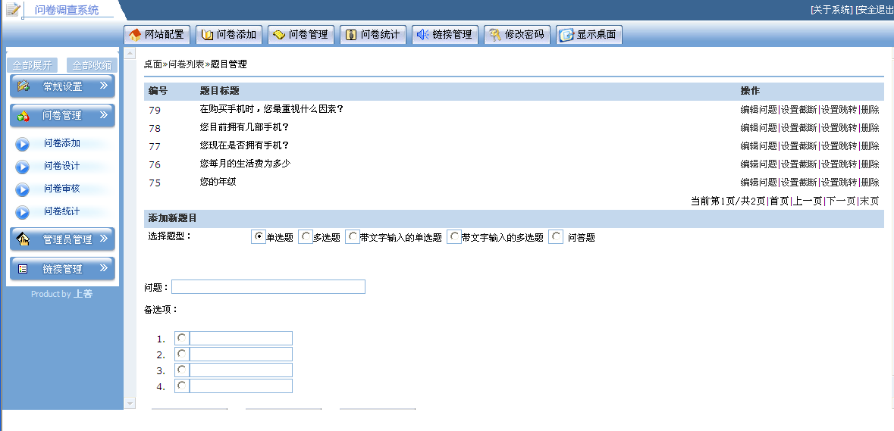
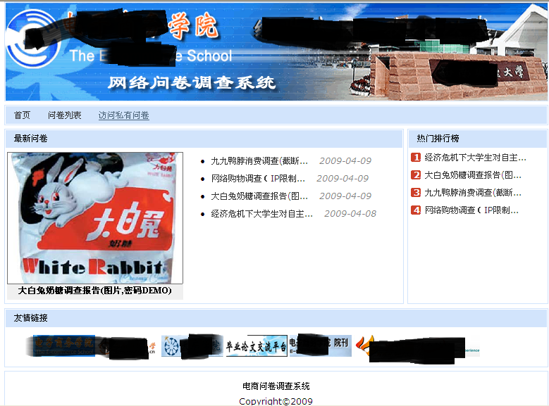
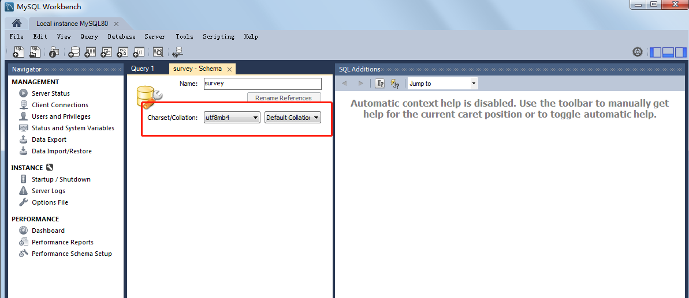

# 项目介绍
这个JAVA网络问卷调查系统是我大学毕业（2009年）时做的毕业设计，在2010年的时候发布到了网络上给大家做交流参考，没想到这么多年过去了，仍然有学生
联系我咨询这个项目的代码问题，因此我决定将这个项目进行部分升级更新后放到github（可能会同步创建一个码云gitee的备份）上来，希望大家一起共同
来维护这个项目。

# 重要提醒
由于是毕业设计，主要目的是研究学习，因此有如下特点和局限：

1、代码几乎没有使用第三方框架，没有MVC框架，没有ORM框架，也没有用spring，全部自己DIY构建的。
这个对于夯实基础知识来说，是有好处的，但是在实际商业项目中，几乎不会这么做，请务必知晓，不喜勿喷。

2、项目没有考虑海量数据和高并发访问量下的性能问题，数据库没有建索引，所以只能算是入门级的小项目。

3、没有做H5！没有移动端！2009年没有这些玩意儿！
# 技术架构
* 语言：JAVA 11 （本次升级仅将JDK升级到了11，代码未做更改，代码的API级别仍然是JDK5，没有用到JDK5之后的新特性）
* 前端JS：使用了prototype.js（可能很多人都没有接触过，无所谓的，仅仅用了很基础的API，相当于jquery）
* 数据库：MySql8.0（十年前我是用sql server2000的，但是考虑到现在的兼容性和版权问题，这次就升级改用mysql8.0了）
* 开发IDE：InteliJ IDEA2019.3.4 （十年前用的myEclipse，但现在毋容置疑IDEA是最好用的IDE，所以我换到这个）
* 项目构建工具：Maven （十年前是直接下载引用第三方jar包，并且用IDE来构建war包，本次升级改成行业更为通用的maven工具）
* 应用容器：Apache Tomcat 9.0.33（十年前用的是tomcat 6.0.18，顺应时代潮流进行更新了）

# 如何构建并运行项目
## 安装Mysql8.0(国内推荐用迅雷下载)
* 下载[Mysql8](https://dev.mysql.com/downloads/mysql/)后采用默认推荐配置安装即可，假设root密码为123456
* 运行Mysql WorkBench，创建一个schema（数据库），字符集选择utf8mb4

* 在Mysql Workbench里，在survey数据库下，执行项目根目录下的[survey.sql](survey.sql)脚本，创建表和初始化数据
## 安装JDK11(国内推荐用迅雷下载)
下载[JDK11](https://www.oracle.com/java/technologies/javase-jdk11-downloads.html#license-lightbox)，采用默认安装。

配置环境变量JAVA_HOME 指向JDK11的安装目录

## 安装Tomcat9
* 下载安装好，运行bin\startup.bat,启动tomcat，若Tomcat乱码问题，修改apache-tomcat-9.0.33/conf/logging.properties把UTF-8改成GBK
* 需要配置数据源，在conf/context.xml里的Context标签下，插入如下内容：
   `<Resource name="jdbc/survey" auth="Container" type="javax.sql.DataSource"
            maxTotal="100" maxIdle="30" maxWaitMillis="10000" username="root"
            password="123456" driverClassName="com.mysql.cj.jdbc.Driver"
            url="jdbc:mysql://localhost:3306/survey?serverTimezone=GMT%2B8&amp;useSSL=false&amp;allowPublicKeyRetrieval=true" />`
## 克隆本代码库到本地
可以克隆，也可以直接[下载包](https://github.com/chenmaolin88/ec-survey/archive/master.zip)

## 在IDEA中导入本项目
* 安装好免费的IDEA 2019.3.4社区版（当然，有钱的同学可以买收费的旗舰版），
* 配置maven仓库的国内镜像，具体操作如下：
    * 在IDEA中，File->Open 本项目，右键单击pom.xml，选择maven->create settings.xml,然后在里面粘贴如下内容：
    `    <mirrors>
             <mirror>
                 <id>alimaven</id>
                 <mirrorOf>central</mirrorOf>
                 <name>aliyun maven</name>
                 <url>http://maven.aliyun.com/nexus/content/repositories/central/</url>
             </mirror>
         </mirrors>`
 * 在右侧的maven面板中，双击survey->Lifecycle->package即可开始编译打包war文件，将该war包部署到TOMCAT中即可。
 

