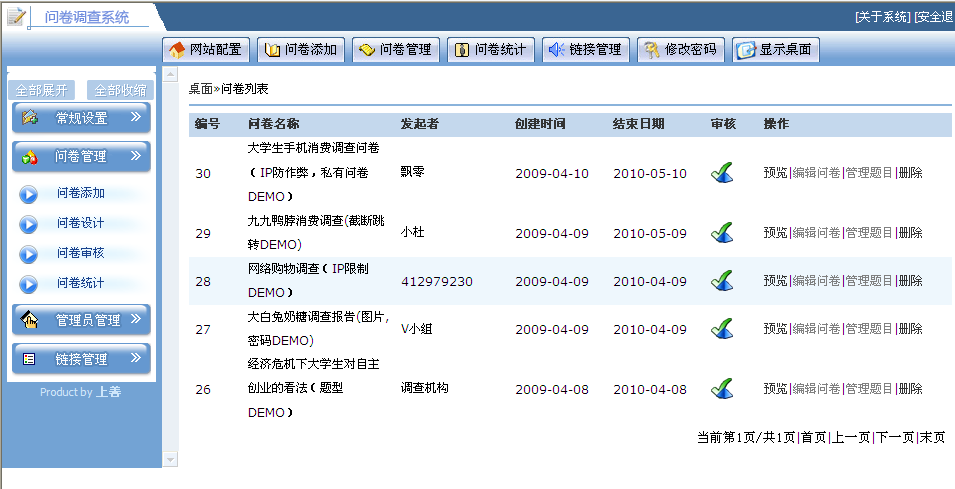
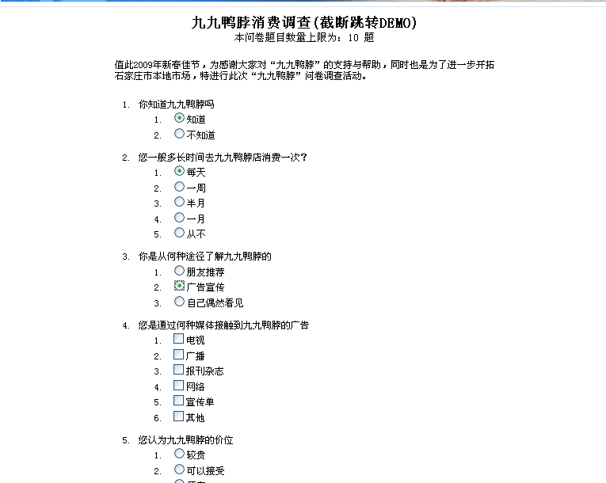

# 项目介绍
这个JAVA网络问卷调查系统是我大学毕业（2009年）时做的毕业设计，在2010年的时候发布到了网络上给大家做交流参考，没想到这么多年过去了，仍然有学生
联系我咨询这个项目的代码问题，因此我决定将这个项目进行部分升级更新后放到github（可能会同步创建一个码云gitee的备份）上来，希望大家一起共同
来维护这个项目。

# 重要提醒
由于是毕业设计，主要目的是研究学习，因此有如下特点和局限：

1、代码几乎没有使用第三方框架，没有MVC框架，没有ORM框架，也没有用spring，全部自己DIY构建的。
这个对于夯实基础知识来说，是有好处的，但是在实际商业项目中，几乎不会这么做，请务必知晓，不喜勿喷。

2、项目没有考虑海量数据和高并发访问量下的性能问题，数据库没有建索引，所以只能算是入门级的小项目。

3、没有做H5！没有移动端！2009年没有这些玩意儿！
# 技术架构
* 语言：JAVA 11 （本次升级仅将JDK升级到了11，代码未做更改，代码的API级别仍然是JDK5，没有用到JDK5之后的新特性）
* 前端JS：使用了prototype.js（可能很多人都没有接触过，无所谓的，仅仅用了很基础的API，相当于jquery）
* 数据库：MySql8.0（十年前我是用sql server2000的，但是考虑到现在的兼容性和版权问题，这次就升级改用mysql8.0了）
* 开发IDE：InteliJ IDEA2019.3.4 （十年前用的myEclipse，但现在毋容置疑IDEA是最好用的IDE，所以我换到这个）
* 项目构建工具：Maven （十年前是直接下载引用第三方jar包，并且用IDE来构建war包，本次升级改成行业更为通用的maven工具）
* 应用容器：Apache Tomcat 9.0.33（十年前用的是tomcat 6.0.18，顺应时代潮流进行更新了）

# 如何构建并运行项目
## 安装Mysql8.0(国内推荐用迅雷下载)
* 下载[Mysql8](https://dev.mysql.com/downloads/mysql/)后采用默认推荐配置安装即可，假设root密码为123456
* 运行Mysql WorkBench，创建一个schema（数据库），字符集选择utf8mb4

## 安装JDK11(国内推荐用迅雷下载)
下载[JDK11](https://www.oracle.com/java/technologies/javase-jdk11-downloads.html#license-lightbox)，采用默认安装。

配置环境变量JAVA_HOME 指向JDK11的安装目录

## 安装Tomcat9
下载安装好，运行bin\startup.bat,启动tomcat，若Tomcat乱码问题，修改apache-tomcat-9.0.33/conf/logging.properties把UTF-8改成GBK

## 克隆本代码库到本地
可以克隆，也可以直接[下载包](https://github.com/chenmaolin88/ec-survey/archive/master.zip)

